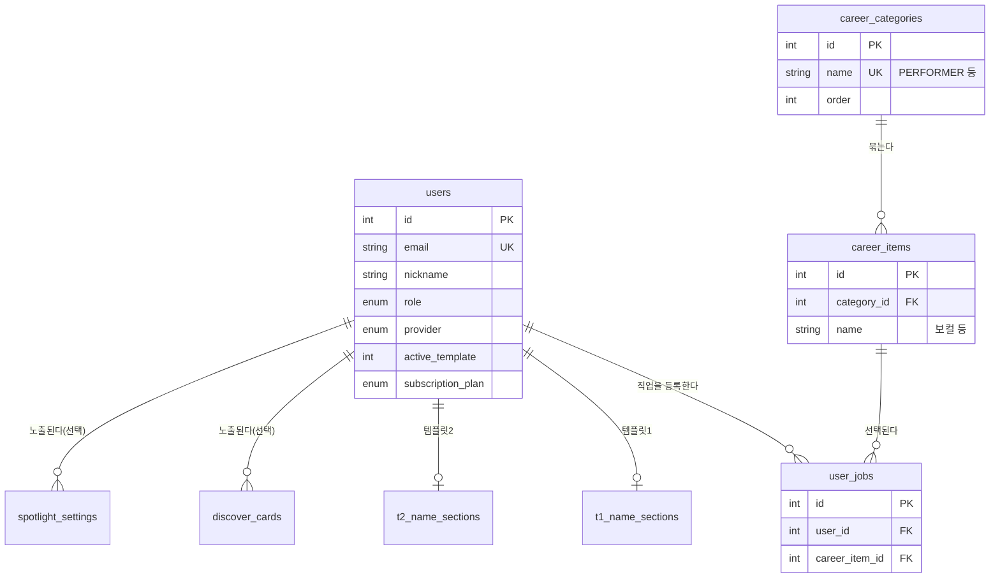

# 데이터베이스 설계

아티스트 포트폴리오 플랫폼의 스키마 설계와 그 배경을 정리한다. DB는
PostgreSQL(Neon), ORM은 SQLModel(SQLAlchemy 기반)이다. 아래 수치는 코드와
Alembic 마이그레이션에서 직접 확인한 것이다.

## 1. 개요 ERD



템플릿(t1_*/t2_*) 쪽 테이블은 사용자당 이름·앨범·연락처·텍스트 섹션으로
구성되고 두 템플릿이 구조가 같아 여기서는 생략했다 — 4번에서 다룬다.

## 2. 정규화 판단 — 직업(career) 분류

직업을 사용자 테이블에 문자열 컬럼(`job = "보컬, 세션기타"`)이나 JSON 배열로
두지 않고 `career_categories` → `career_items` → `user_jobs`(다대다) 세
테이블로 나눴다. 문자열/JSON 컬럼이었다면 생겼을 문제:

| 이상 현상 | 문자열 컬럼이었다면 |
|---|---|
| 갱신 이상 | "기타리스트"를 "기타 연주자"로 표기를 바꾸려면 그 문자열을 가진 모든 사용자 행을 찾아 일괄 수정해야 한다. 하나라도 놓치면 같은 직업이 두 가지 이름으로 공존한다. |
| 삽입 이상 | 아직 아무도 선택하지 않은 새 직업 항목("사운드 디자이너")을 목록에 추가할 방법이 없다 — 그 직업을 가진 사용자가 생겨야 문자열이 처음 등장한다. |
| 삭제 이상 | 어떤 직업을 선택한 마지막 사용자가 탈퇴하면 그 직업이 시스템에 존재했다는 사실 자체가 사라진다. |
| 조회·집계 | "PERFORMER 대분류에 속한 직업이 몇 종류인가" 같은 질의를 문자열 매칭(`LIKE`)에 의존해야 한다. |

`career_categories`(대분류: PERFORMER 등)와 `career_items`(세부: 보컬,
기타리스트 등)를 분리한 것도 같은 이유다 — 대분류는 헤더 메뉴에, 세부는
가입/프로필 편집 화면에 각각 쓰이는데 하나로 합쳐 두면 "이 항목이 어느
메뉴에 나오는가"를 문자열 파싱으로 판단해야 한다.

`user_jobs`는 사용자 한 명이 여러 직업을(예: 보컬+기타리스트) 가질 수 있고
직업 하나에 여러 사용자가 속하는 다대다 관계라 연결 테이블이 필요하다.
`user_jobs.user_id`에는 `ondelete="CASCADE"`가 걸려 있어 사용자가 탈퇴하면
연결 행이 자동으로 정리된다(`career_item_id` 쪽에는 없다 — 직업 항목은
사용자보다 수명이 길어야 하는 기준 데이터라 실수로 지워지면 안 된다).

## 3. 템플릿별 테이블 분리(t1_*/t2_*)

포트폴리오 템플릿 1·2는 각자 `name_sections`/`album_sections`/
`text_sections`/`contact_sections`를 갖고, 템플릿 2만 `image_sections`가
추가로 있다. 두 템플릿을 같은 테이블에 넣지 않고 `t1_*`/`t2_*`로 물리적으로
나눴다 — 템플릿마다 스키마를 독립적으로 진화시킬 수 있어야 한다는 판단이다
(실제로 템플릿 2에만 `activity_area` 컬럼과 이미지 섹션이 있다). 이 분리
자체는 근거가 있는 선택이다.

문제는 테이블 분리가 **파이썬 코드의 복제**로 이어진 것이었다. `api/profile.py`가
898줄이었고 그중 약 600줄이 템플릿 1·2용으로 거의 같은 코드 두 벌이었다
(내 포트폴리오 조회 두 벌, 공개 조회의 템플릿 분기 두 벌, 저장 로직 두 벌).
템플릿 1과 템플릿 2의 실제 차이는 `T2NameSection.activity_area` 필드 하나와
이미지 섹션 유무뿐이었다.

`app/services/portfolio.py`에 `TemplateModels`(어떤 템플릿이 어떤 모델
묶음을 쓰는지 담는 데이터클래스)를 두고, 읽기·저장 로직을 그 묶음 하나만
보고 동작하도록 한 벌로 합쳤다:

```python
@dataclass(frozen=True)
class TemplateModels:
    number: int
    name_section: Type
    album_section: Type
    youtube_card: Type
    ...
    image_section: Optional[Type] = None   # 템플릿 2 전용, 없으면 None

TEMPLATES = {1: TemplateModels(number=1, ...), 2: TemplateModels(number=2, ...)}
```

`api/profile.py`는 이제 `TEMPLATES[번호]`를 골라 `portfolio.load_portfolio(...)`
하나만 호출한다. 템플릿 3이 추가되면 `TEMPLATES`에 항목 하나를 더하는 것으로
끝나고, 서비스 로직은 손댈 필요가 없다. **테이블을 나눈 결정은 유지하고,
코드가 그 결정을 따라 복제된 것만 되돌린 것**이 이 정리의 요지다.

## 4. 스키마 드리프트

배포 스크립트가 기동할 때마다 운영 DB에 `CREATE TABLE IF NOT EXISTS` 류의
DDL을 실행하는 구조였다. 이 방식의 문제는 모델 코드와 실제 운영 스키마가
서서히 갈라진다는 것이다 — 누군가 운영 DB에 직접 `ALTER TABLE`을 실행하면
그 변경은 모델 코드 어디에도 기록되지 않는다.

실제로 이 프로젝트에서 그렇게 갈라진 부분이 있었다: 운영 DB의 FK 27개에
`ON DELETE CASCADE`가 걸려 있었는데(`user_jobs.user_id`,
`discover_cards.artist_id` 등), 이 CASCADE는 모델 코드에 없었다 — 운영 DB에
직접 추가된 것이었다. 그 결과 **빈 DB에서 이 코드를 새로 기동하면 스키마
자체가 달랐다** — 부팅 스크립트가 만드는 테이블에는 그 CASCADE가 없었다.

Alembic을 도입해 현재 운영 스키마를 `baseline` 리비전으로 캡처했다
(`alembic/versions/..._baseline_existing_production_schema.py`). 이 리비전에
`ondelete='CASCADE'`가 27번 나온다 — 모델 코드만 보고 새로 만들었다면 빠졌을
27곳이 전부 기록됐다는 뜻이다. `app/main.py`는 이제 기동 시 DDL을 실행하지
않는다:

```python
# 스키마 생성과 기준정보 시드는 Alembic 마이그레이션이 담당한다.
# 부팅 때마다 운영 DB에 DDL을 실행하던 구조를 걷어냈다.
```

이후 스키마 변경은 전부 `alembic revision --autogenerate` → 리뷰 → `upgrade`
경로를 거친다. 운영 DB에 직접 손대는 경로가 없어야 baseline 이후로 드리프트가
다시 생기지 않는다.

## 5. 인덱스

**FK는 자동으로 인덱스가 붙지 않는다.** Postgres는 기본키(PK)에는 인덱스를
자동 생성하지만 외래키(FK) 컬럼에는 만들지 않는다 — FK 제약은 "참조 무결성"만
보장하고 "그 컬럼으로 조회가 빠르다"는 걸 보장하지 않는다. 이 프로젝트에서
`user_id=...`로 자기 섹션을 찾는 조회가 템플릿마다 여러 번 나가는데, 확인해보니
`t1_text_sections.user_id`처럼 unique가 아닌 FK 컬럼에는 인덱스가 없다
(반대로 `t1_name_sections.user_id`처럼 `unique=True`가 걸린 컬럼은 유니크
제약이 인덱스를 동반하므로 이미 인덱스가 있다). 유저당 데이터량이 아직
작아 당장 체감되는 문제는 아니지만, 명시적으로 남겨 둔다(7번).

**N+1 제거.** 포트폴리오 조회(`load_portfolio`)가 예전에는 텍스트 섹션 S개,
섹션당 카드 C개일 때 `9 + S + S*C`회의 쿼리를 실행했다 — 섹션을 가져온 뒤
섹션마다 카드를 다시 조회하고, 카드마다 세부 항목을 또 조회하는 구조였다.
실제 사용자 데이터(텍스트 섹션 5개·카드 25개, S=5, C=25)로 재면
`9+5+25=39`회다. 섹션 3개·카드 4개(S=3, C=4)로 예를 들면 `9+3+12=24`회다 —
둘 다 같은 공식에 입력만 다르다. 각 관계 조회에 `selectinload`를 걸어 자식
레코드를 한 번에 끌어오도록 바꿨다:

```python
select(tpl.text_section)
    .where(tpl.text_section.user_id == user_id)
    .options(
        selectinload(tpl.text_section.cards)
        .selectinload(tpl.text_card.body_items)
    )
```

그 결과 쿼리 수가 데이터 양과 무관하게 고정된다 — 템플릿 1은 11회,
템플릿 2는 이미지 섹션이 하나 더 있어 14회다. 위의 텍스트 섹션 5개·카드
25개짜리 실사용자 기준으로는 39회 → 11회다.

## 6. 남은 것

- `t1_*`/`t2_*`의 FK 컬럼 대부분에 명시적 인덱스가 없다(5번). 유저 수가
  늘면 붙여야 한다.
- `discover_cards.artist_id`/`spotlight_settings.artist_id`는
  `ondelete="SET NULL"`이다 — 지정한 아티스트가 탈퇴하면 슬롯이 빈 채로
  남는다(자동으로 다른 아티스트로 채워지지 않는다). 운영 정책으로 다뤄야
  하는 부분이라 스키마 차원에서는 의도적으로 열어 뒀다.
- baseline 이후 실제 마이그레이션 워크플로(스테이징에서 먼저 적용해 보는지,
  롤백 절차가 있는지)는 이 문서 범위 밖이다.
